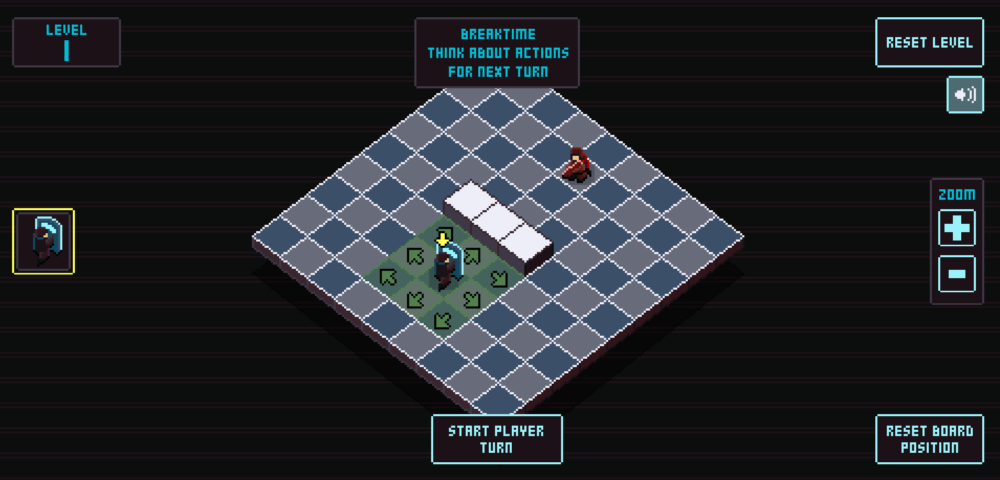

# 13s Tactics

Is a tactical/chess/puzzle game where you need to perform all your actions in 13 seconds before your enemies.

You will fear the number 13! Not just because you will run out of time but you will loose your characters after your turn!

And of course this game contains 13 levels!

You can play a live version here: https://igorfie.gitlab.io/13s-tactics/

This game was created for the [2024 js13kGames](https://js13kgames.com/) where the theme was `Triskaidekaphobia`.

## Game instructions

### General
- Game board can be dragged around for a better interaction/position.
- Game board position can be reset with the bottom right `Reset Board Position` button.
- Click on the zoom `+`/`-` buttons to increase/reduce the game board size.
- Click on the top right `Reset level` button to reset the level at any time.
- Clicking the speaker button will mute the game sounds.
- Clicking on the left character will select that character on the board and vice versa.
- A level is completed when all enemies or player characters are eliminated.

### Breaktime Turn
- Player can select characters to understand their movement pattern.
- When ready, the player can start the turn by clicking on the `Start player turn` button.

### Player Turn
- Perform as many/needed actions in 13 seconds.
- After 13 seconds your turn finishes.

### Enemy Turn
- Enemies also have 13 seconds to perform their actions.
- After 13 seconds their turn ends and we go back into Breaktime.

## TODO-FOR-FUTURE-ME
- Make enemy skip their turn when they don't have movement options.
- Add a skip button for players to skip their turn.
- Add a progression/campain screen so players can play from where they left off or play/revisit old puzzles.
- Add more characters types (it would be interestig having one that could break walls, medic, etc).
- Add ability to resize screen.

### Setup
Run `npm install` on a terminal

### Development
Run `npm run start` to start the game in a development server on `localhost:8080`.

### Production
Use `npm run build` to create minified file and zip him with the `index.html`. The result will be available in the `build` directory.